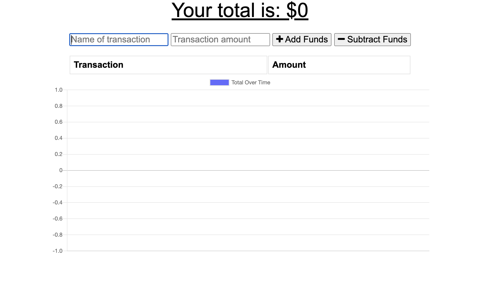
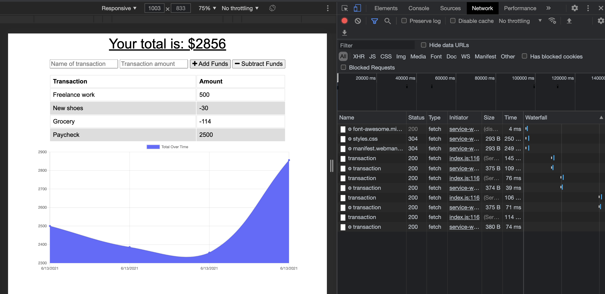
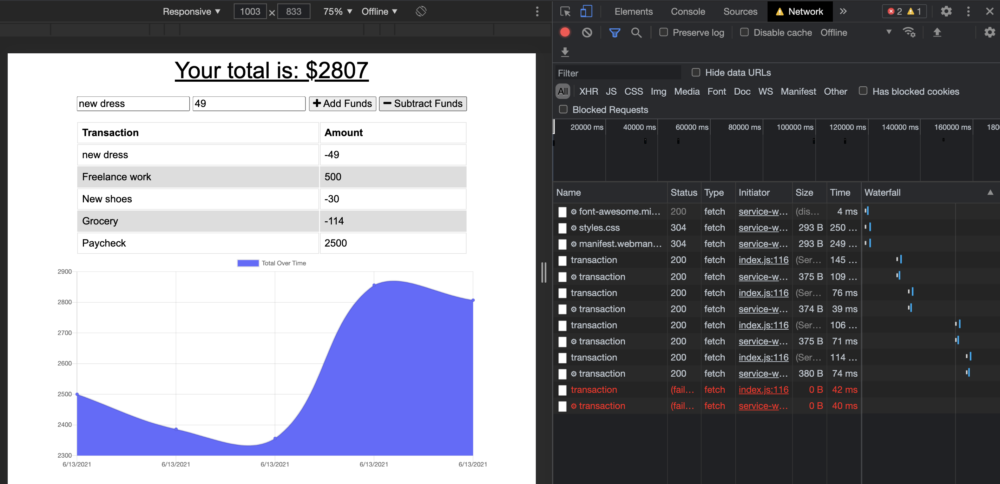

# PWA: Online/Offline Budget Tracker

  

  ## Table of Contents
  * [Description](#description)
  * [Installation](#installation)
  * [Usage](#usage)
  * [Contact Information](#contact-information)
  * [License](#license)
  
  
  ## Description
  For this assignment we were challenged to add functionality to an already existing budget app. The app should be able to function whether online or offline.

  ### User Story
  AS AN avid traveller I WANT to be able to track my withdrawals and deposits with or without a data/internet connection SO THAT my account balance is accurate when I am traveling
  
  ## Installation
  To install this app, these user will need to ensure that they've downloaded all the necessary dependencies. These dependencies include 
  * `express` 
  * `mongoose`
  
  ## Usage
  Upon visiting the budgeting webiste, the user will be greeted with the following page. 
  
  
  Theres an input form at the top of the page where the user may enter deposists and expenses. The amount entered in must be able to populate whether the user is online or offline. Below is an image of the website online. 
  
  
  The below is an image of the website offline. The website populated both when it was online and offline
  

  Please use the below link to view the app:

  * [Budget Tracker](https://afternoon-mountain-58451.herokuapp.com/)

  * [Github Repo](https://github.com/crystal-g-b/PWA-Online-Offline-Budget-Trackers)

  
  ## Contact-Information
  * GitHub: [crystal-g-b](https://github.com/crystal-g-b)
  * Email: crystal.barnett1@gmail.com
  
  ## License:
  * [The MIT License](https://opensource.org/license/MIT)
